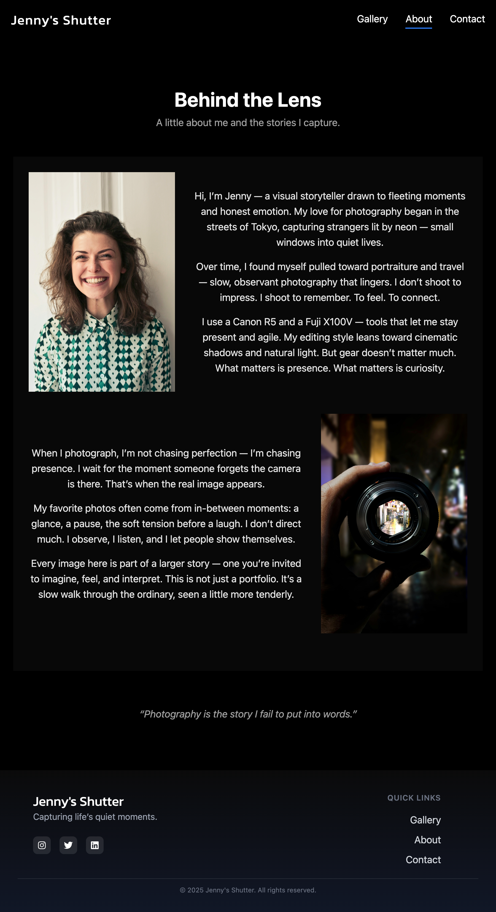
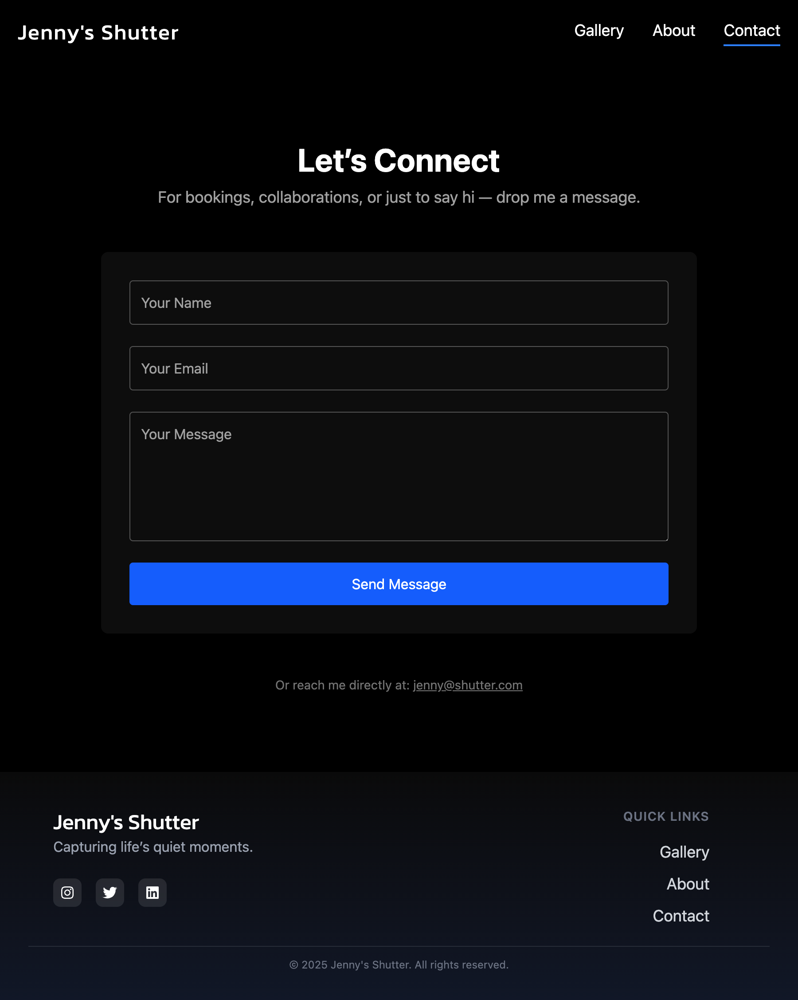

# Photographer Portfolio Website  
A responsive image gallery featuring category filters, search, sorting options, and interactive flip animations.

---

## Live Demo  
Check it out here: [https://lmalhaim.github.io/photographer-portfolio/](https://lmalhaim.github.io/photographer-portfolio/)

---

## Features

- 📂 **Category Filtering** – Easily browse images by category.  
- 🔍 **Search** – Quickly find photos by location or caption.  
- ↕ **Sorting** – Sort images by relevance, location, or date.  
- 🔄 **Flip Animation** – Click images to reveal more details on the back.  
- 🖱️ **Hover Effects** – Smoothly enlarge images on hover for better viewing.  
- 📱 **Responsive Layout** – Looks great on all devices, from mobile to desktop.

---

## Tech Stack

- **React** + **TypeScript**  
- **Tailwind CSS** for styling

---

## Installation

```bash
git clone https://github.com/lmalhaim/photographer-portfolio
cd photographer-portfolio
npm install
npm run dev
```
---

## Screenshots

  

  

  